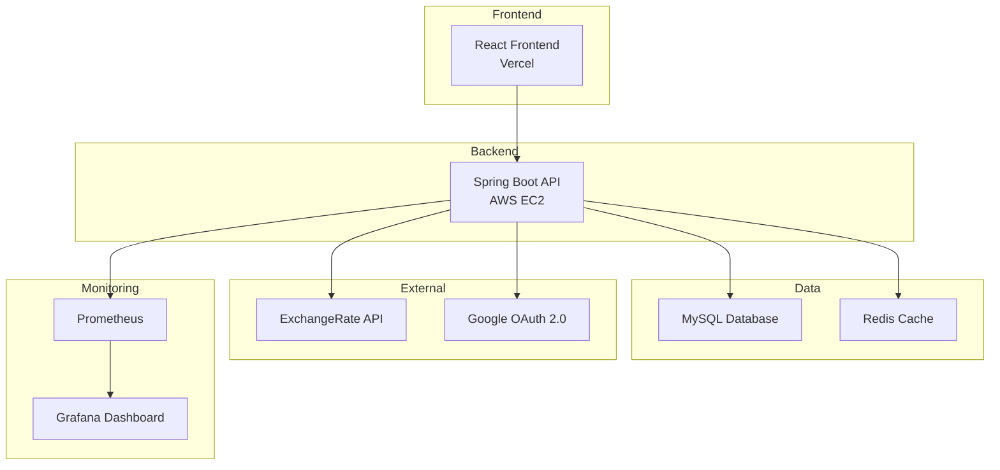

# 💱 Exchange Rate & Remittance Application

> 환율 조회와 해외 송금 서비스를 가상으로 구축한 웹 애플리케이션

---

### Backend
 
 
 
 
 
 

### DevOps & Monitoring
 
 
 
 

### Frontend
 
 
 
 

---

## 📸 프로젝트 소개

환율 API를 통한 환율 정보 조회와 해외 송금 서비스를 제공하는 웹 애플리케이션입니다.  
사용자는 Google OAuth 2.0 로그인 후 환율 조회, 송금 시뮬레이션, 실제 송금 처리, 송금 한도 관리, 송금 내역 조회 등의 기능을 이용할 수 있습니다.  
Google OAuth 2.0 인증, Redis 캐싱, Docker 컨테이너화, Prometheus/Grafana 모니터링 및 알림 등 실무 기술을 활용하여 구축했습니다.

> **주요 화면 보기**: [Wiki에서 확인](https://github.com/dongjang/exchange_rate/wiki)

---

## 🛠️ 기술 스택

### Backend
| 기술 | 버전 | 설명 |
|------|------|------|
| **Java** | 17 | 프로그래밍 언어 |
| **Spring Boot** | 3.2.6 | 웹 프레임워크 |
| **Spring Security** | - | 인증/인가 |
| **Spring Data JPA** | - | 데이터 액세스 |
| **MyBatis** | 3.0.3 | SQL 매퍼 |
| **MySQL** | 8.0 | 데이터베이스 |
| **Redis** | 7 | 캐시 서버 |

### DevOps & Monitoring
| 기술 | 설명 |
|------|------|
| **Docker** | 컨테이너화 |
| **GitHub Actions** | CI/CD 파이프라인 |
| **AWS EC2** | 클라우드 호스팅 |
| **Prometheus** | 메트릭 수집 |
| **Grafana** | 모니터링 대시보드 |

### Frontend
| 기술 | 버전 | 설명 |
|------|------|------|
| **React** | 18 | UI 라이브러리 |
| **TypeScript** | 5.8 | 타입 안전성 |
| **Vite** | 7.0 | 빌드 도구 |
| **Jotai** | 2.12 | 상태 관리 |
| **React Router** | 6.30 | 라우팅 |

---

## 🏗️ 시스템 아키텍처

## 🌟 핵심 기능

- **💱 환율 조회** - ExchangeRate-API를 통한 환율 정보 조회 및 Redis 캐싱
- **💸 송금 시뮬레이션** - 수수료와 환율을 고려한 송금 금액 계산
- **🚀 실제 송금 처리** - 한도 검증 후 송금 실행 및 상태 추적
- **👤 사용자 관리** - Google OAuth 2.0 로그인, 프로필 관리, 은행 계좌 등록
- **📊 송금 한도 관리** - 월 송금 한도 설정 및 변경 신청, 서류 업로드
- **📋 송금 내역** - 과거 송금 내역 조회 및 검색색
- **📢 고객지원** - 공지사항 조회 및 로그인 시 긴급 공지 모달 표시 , Q&A 시스템
- **📱 반응형 디자인** - 모바일/데스크톱 최적화된 UI/UX

## 🚀 실행 방법 (개발/테스트 기준)

- **환경**: Java 17+, Node.js 18+, Docker & MySQL 8, Redis 7
- **권장 실행**: `docker-compose up -d`
- **로컬 개발**: 백엔드 `./gradlew bootRun`, 프론트엔드 `npm run dev`

## 🛠️ 개발 과정에서의 도전과 해결

### 🤖 AI 활용 개발 효율화
- **문제**: 전체 비즈니스 로직 AI 구현 요청 → 결과 미흡, 시간 소모
- **해결**: AI로 초기 틀 구축 후 세부 로직/쿼리 직접 작성
- **결과**: 개발 효율 향상, 시간 절약

### 💱 외부 환율 API 호출 최적화
- **문제**: 무료 API는 일 1회만 갱신, 페이지 진입 시마다 호출 → 호출 한도 위험
- **해결**: Redis 캐시 도입, 캐시 미스 시에만 API 호출
- **결과**: 불필요한 호출 방지, 안정성 향상

### 👥 사용자/관리자 기능 분리
- **문제**: 동일 세션에서 로그인/로그아웃 충돌, 권한 관리 복잡
- **해결**: 사용자/관리자 영역 분리, 인증 로직 명확화
- **결과**: 유지보수 용이, 안정성 및 보안성 향상

### 🐳 서버 실행 환경 개선
- **문제**: EC2에서 jar 실행 시 환경 변수 수동 설정 필요
- **해결**: Docker Compose 도입 → 한 번의 명령으로 전체 실행
- **결과**: 서버 실행 간편화, 개발 효율 향상상

### 🏦 실제 송금/인증 API 부재 문제
- **문제**: 개인 프로젝트 특성상 휴대폰/계좌 인증 및 은행/개인 정보 검증 API 미제공 → 실제 API 호출 불가
- **해결**: 사용자 입력 기반 송금 데이터 처리, 국가·통화·은행 정보는 AI로 수집 후 DB 저장, 환산 금액 실시간 계산
- **결과**: 실제 API 없이도 송금 프로세스와 데이터 처리 로직 구현 

---

## 🌐 체험하기

> ⚠️ **로그인 시 502 Bad Gateway 에러 발생 시**: EC2 서버가 중지 상태입니다. 개인 프로젝트 특성상 비용 절약을 위해 필요시에만 서버를 가동합니다.

**🔗 사용자 서비스**: [https://exchange-rate-theta-blue.vercel.app/](https://exchange-rate-theta-blue.vercel.app/)

> 💡 Google 계정으로 로그인 후 환율 조회 및 송금 시뮬레이션을 체험해보세요!

**🔗 관리자 시스템**: [https://exchange-rate-admin.vercel.app/](https://exchange-rate-admin.vercel.app/)

> 💡 **관리자 계정은 보안상 따로 공개하지 않습니다. 체험을 원하시면 아래 정보로 연락 부탁드립니다.**
> 
> 📧 **문의**: [jdwls27@gmail.com](mailto:jdwls27@gmail.com)

## 📁 프로젝트 저장소
- **사용자 프로젝트**: 현재 저장소
- **관리자 프로젝트**: [https://github.com/dongjang/exchange_rate_admin](https://github.com/dongjang/exchange_rate_admin)

## 📋 배포 환경
- **사용자 프론트엔드**: Vercel (React SPA 배포) - 사용자 UI 구현
- **관리자 프론트엔드**: Vercel (React SPA 배포) - 관리자 UI 구현  
- **백엔드**: AWS EC2 + Docker (컨테이너화된 Spring Boot) - 관리자/사용자 공통 API 서버